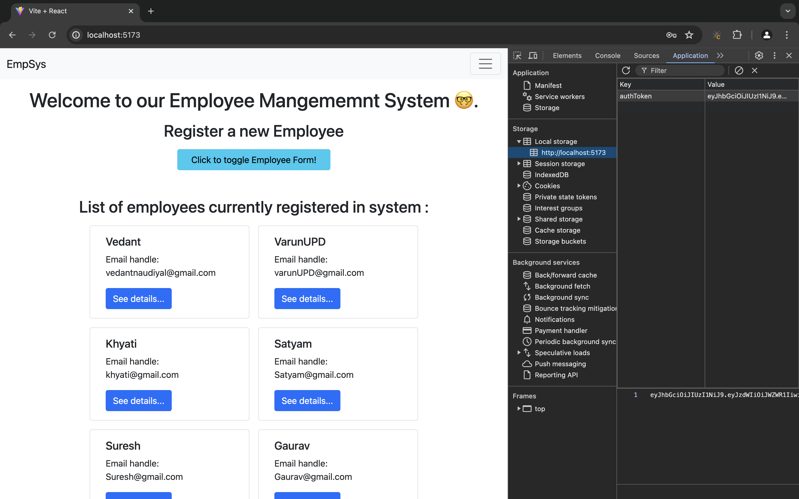
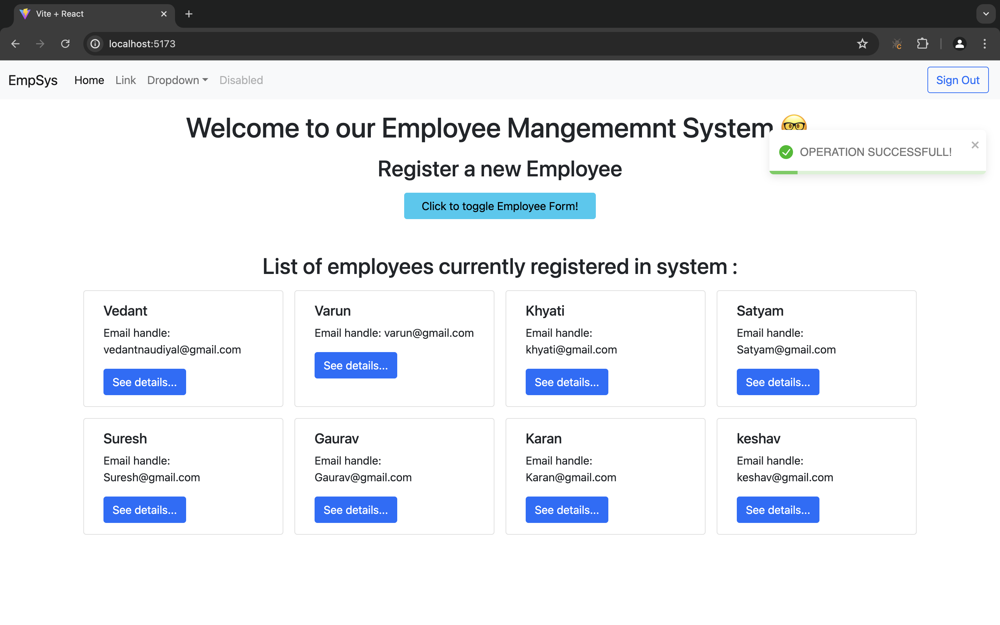

# React + Vite

This template provides a minimal setup to get React working in Vite with HMR and some ESLint rules.

Currently, two official plugins are available:

- [@vitejs/plugin-react](https://github.com/vitejs/vite-plugin-react/blob/main/packages/plugin-react/README.md) uses [Babel](https://babeljs.io/) for Fast Refresh
- [@vitejs/plugin-react-swc](https://github.com/vitejs/vite-plugin-react-swc) uses [SWC](https://swc.rs/) for Fast Refresh

# FRONTEND FOR SPRINGBOOT APPLICATION (CRUD + JWT SECURITY)

## TECHNOLOGIES AND STRUCTURE :

- bootstrap components
  1. Modals
  2. Navbar
  3. Card
  4. Jumbotron
  5. Basic classes and styling

- React
  1. functional based components
  2. Context apis (to avoid props drilling and state management)
  3. React-router-dom (for navigation)
  4. React-toastify (for showing alerts)

- structure
  1. components
  2. pages
  3. configs
  4. utils
  5. routes
  6. contexts
  7. layouts

## SCREENSHOTS:

- LOGIN PAGE

- SIGN UP PAGE

- HOME PAGE

- DETAILS PAGE

- CRUD OPERATIONS

1. DELETE

2. UPDATE

3. ADD

- FORBIDDEN

1. CRUD operations with USER role:

2. violating backend validations for employee fields

(using futuristic date etc.)

(WITH ADMIN ROLE)

